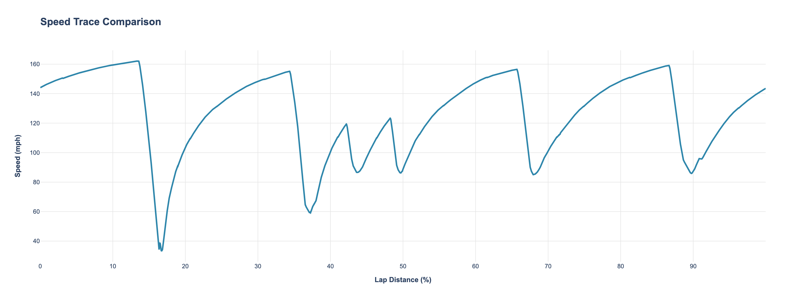
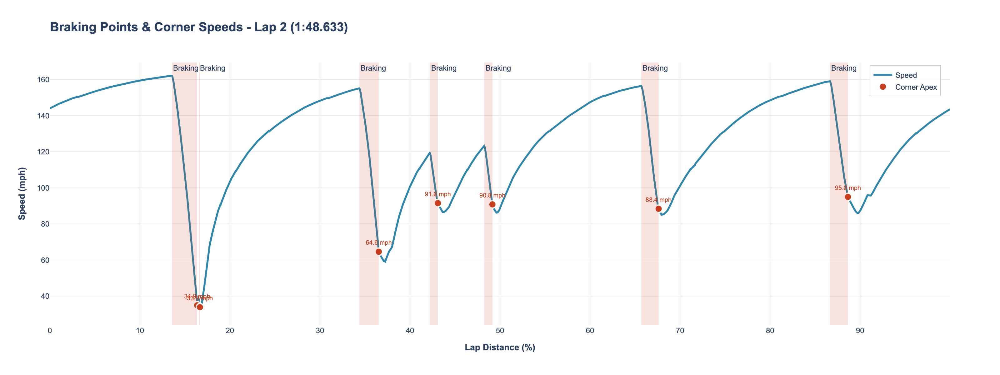
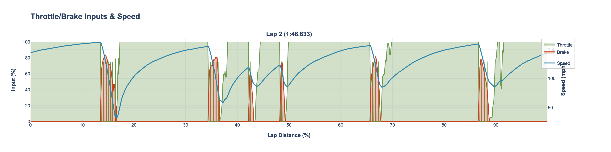
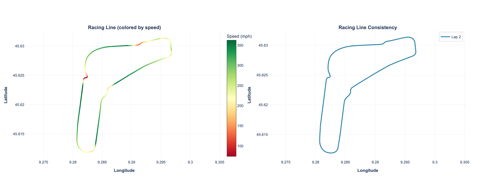

# iRacing Telemetry Analysis

> Convert iRacing `.ibt` telemetry into an interactive HTML report for post-session analysis.

[](https://github.com/kushalhebbar/iracing_TelemetryAnalysis/actions/workflows/ci.yml)
[](https://www.python.org/)
[](https://github.com/astral-sh/ruff)
[](https://mypy-lang.org/)
[](LICENSE)

I built this to review my own iRacing practice sessions. It reads a telemetry
recording, keeps only the complete laps, and writes one interactive HTML report plus a
markdown summary covering delta traces, corner-by-corner speeds, braking points,
consistency scoring, trail-braking detection, and a GPS racing line.

## Sample output

The command generates a self-contained interactive report you can open in any browser.
A committed example lives in [`examples/`](examples/).

| Speed traces | Braking points |
| --- | --- |
|  |  |

| Throttle / brake inputs | GPS track map |
| --- | --- |
|  |  |

- Interactive report: [`examples/sample_telemetry_report.html`](examples/sample_telemetry_report.html)
- Markdown summary: [`examples/sample_report.md`](examples/sample_report.md)

## Quickstart

```bash
# 1. Install dependencies (Poetry: https://python-poetry.org/docs/#installation)
poetry install

# 2. Drop a .ibt file in ibt_input/ and run the analysis
poetry run iracing-telemetry "ibt_input/<your-file>.ibt"
```

### CLI

```
iracing-telemetry INPUT [-o OUTPUT_DIR] [--no-plots] [-v]

  INPUT                 Path to a .ibt file
  -o, --output-dir DIR  Base directory for output (default: current directory)
  --no-plots            Export CSVs only, skip plots and report
  -v, --verbose         Enable DEBUG logging
```

**Outputs** (written under `csv_output/` and `plots/`):

| File | Description |
| --- | --- |
| `<track>_<date>.csv` | Full telemetry (all channels) |
| `<track>_<date>_filtered.csv` | Essential channels only |
| `<track>_<date>_lap<N>.csv` | One file per complete lap |
| `<track>_<date>_summary.csv` | Per-lap statistics |
| `<track>_<date>_telemetry_report.html` | Interactive report (all plots) |
| `report.md` | Markdown analysis summary |

## What it analyses

- **Lap detection** — only laps covering ≥90% of the track are analysed, filtering out
  out-laps and partial recordings.
- **Delta time** — time gained/lost versus the fastest lap at every point on track.
- **Corner-by-corner** — auto-detected corners with entry/apex/exit speeds, brake points,
  and per-corner consistency.
- **Consistency scoring** — lap-time and speed standard deviation scored 0–100.
- **Inputs** — throttle/brake smoothness ratings and gear-shift RPM patterns.
- **Trail braking** — detects braking-while-turning and measures brake-release rate.
- **Racing line** — GPS (lat/lon) line coloured by speed, overlaid across laps.

All speeds are converted from iRacing's native m/s to mph.

## Project structure

```
src/iracing_telemetry/
├── cli.py            # Argument parsing and entry point
├── convert.py        # .ibt -> DataFrame -> CSV export + per-lap splitting
├── analysis.py       # Lap stats and the markdown report
├── plotly_plots.py   # Interactive Plotly figures + combined HTML
├── utils.py          # Shared helpers (config, lap validation, formatting)
└── constants.json    # Tunable thresholds (lap validation, corner detection, ...)
tests/                # pytest suite with synthetic telemetry fixtures
examples/             # Committed sample report and screenshots
```

Analysis thresholds (lap completeness, corner detection, smoothness ratings, etc.) are
centralised in `constants.json` rather than hard-coded, so they can be tuned without
touching the analysis logic.

## Development

```bash
poetry install          # install runtime + dev dependencies
poetry run pytest       # run the test suite
poetry run ruff check . # lint
poetry run mypy         # type-check
```

Continuous integration (`.github/workflows/ci.yml`) runs lint, type-check, and tests on
Python 3.11 and 3.12 for every push and pull request.

## Tips for better analysis

- Record 3–5+ complete laps for meaningful consistency and corner comparisons.
- Delta time and corner-to-corner comparisons require at least two complete laps.
- Avoid saving telemetry mid-lap so lap detection stays accurate.

## License

[MIT](LICENSE)

